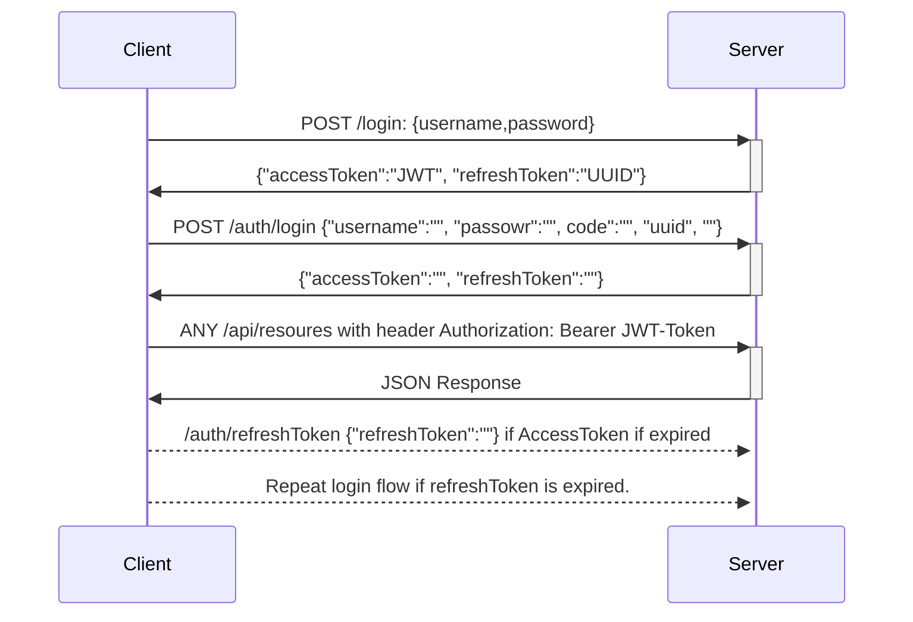

# JWT Flow

```mermaid
%% JWT flow: view it in typora or https://bramp.github.io/js-sequence-diagrams/
sequenceDiagram
    participant c as Client
    participant s as Server

c->>+s: POST /login: {username,password}
s->>-c:  {"accessToken":"JWT", "refreshToken":"UUID"}
c->>+s: POST /auth/login {"username":"", "passowr":"", code":"", "uuid", ""}
s->>-c: {"accessToken":"", "refreshToken":""}
c->>+s: ANY /api/resoures with header Authorization: Bearer JWT-Token
s->>-c: JSON Response
c-->>+s: /auth/refreshToken {"refreshToken":""} if AccessToken if expired
c-->>+s: Repeat login flow if refreshToken is expired.
```
