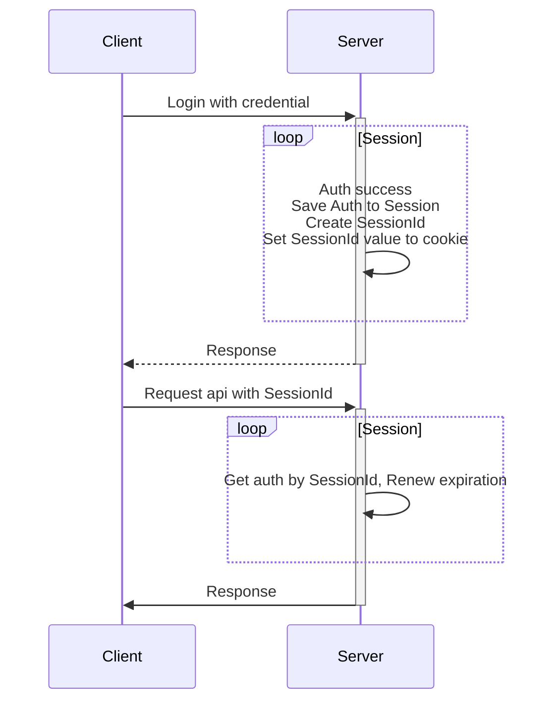

<!-- # Session Flow -->

## 1. 流程

```mermaid
sequenceDiagram
    participant c as Client
    participant s as Server

   c->>+s: Login with credential
   loop Session
   s->>s: Auth success<br/>Save Auth to Session<br/>Create SessionId<br/>Set SessionId value to cookie
   end
   s-->>-c: Response
   c->>+s: Request api with SessionId
   loop Session
   s->>s: Get auth by SessionId, Renew expiration
   end
   s->>-c: Response
```

## 2. 特点

- 在服务器端Cookie中保存的是Session ID, 可以理解为UUID
- Session自动续签功能容易实现
- 用户登录并发限制，比如可以限制一个用户账号只能同时有一个会话，如果其他人以相同的账号登录，可以挤掉上个登录者，或者登录不了。
